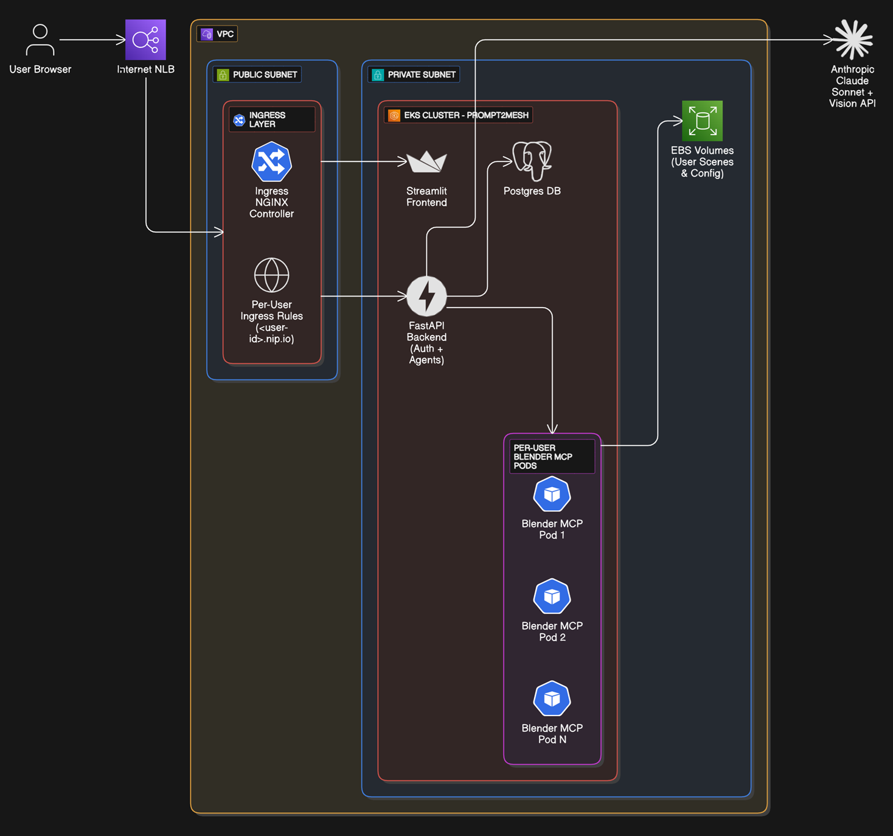
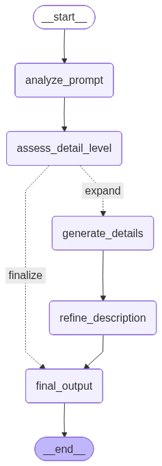
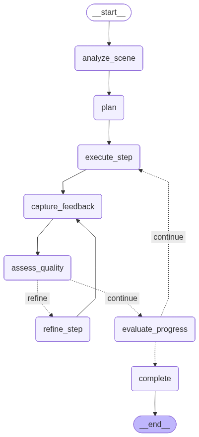

# Prompt2Mesh
AI-Powered 3D Modeling with Natural Language

Transform text prompts into 3D models using **LangChain + LangGraph multi-agent system** with **Claude Sonnet 4.5** and **Blender MCP**.

**🌐Demo:** http://a4492a6f36024441e8d6740b22fe8ee4-1878007781.us-east-1.elb.amazonaws.com:8501

---

## 🏗️ Architecture



**Multi-Agent System with Vision-Based Refinement:**

### Prompt Refinement Agent Workflow


The **Refinement Agent** enhances user prompts with technical specifications before execution.
### Artisan Agent Workflow (LangGraph)


The **Artisan Agent** autonomously plans, executes, and refines 3D modeling steps with vision-based quality assessment.

---

## 🚀 Quick Start - AWS EKS Deployment

### Prerequisites
```powershell
# Install required tools
winget install Amazon.AWSCLI
choco install eksctl
choco install kubernetes-cli

# Configure AWS credentials
aws configure
```

### 1. Create EKS Cluster
```powershell
eksctl create cluster -f eks-cluster-config.yaml
```

### 2. Setup ECR & Build Images
```powershell
# Create ECR repositories
.\infrastructure\ecr-setup.ps1

# Build and push Docker images
.\scripts\build-and-push-images.ps1
```

### 3. Deploy to Kubernetes
```powershell
# Create namespace and secrets
kubectl create namespace prompt2mesh
kubectl create secret generic prompt2mesh-secrets -n prompt2mesh \
  --from-literal=db-password=<YOUR_PASSWORD> \
  --from-literal=jwt-secret=<YOUR_SECRET> \
  --from-literal=anthropic-api-key=<YOUR_KEY>

# Deploy all services
kubectl apply -f k8s/
```

### 4. Access Application
```powershell
# Get LoadBalancer URL
kubectl get svc frontend -n prompt2mesh
```

Open the `EXTERNAL-IP` URL in your browser on port 8501.

**📖 Detailed Guide:** See [EKS Setup Guide](docs/EKS_SETUP_GUIDE.md) for complete instructions.

## ✨ Key Features

### 🤖 LangChain + LangGraph Multi-Agent System
- **Artisan Agent**: Autonomous 3D modeling with 8-node LangGraph workflow
- **Refinement Agent**: Prompt enhancement with technical specifications with 5-node LangGraph workflow
- **Vision AI**: Claude Sonnet 4.5 Vision for quality assessment
- **Iterative Refinement**: Automatic quality scoring and improvement loops

### 🔧 Technical Stack
- **LangChain**: Tool abstraction over Blender MCP operations
- **LangGraph**: StateGraph workflow with checkpointing
- **Claude Sonnet 4.5**: Tool calling + vision analysis
- **Blender MCP**: Model Context Protocol for Blender operations
- **Kubernetes**: Per-user pod isolation on AWS EKS

### 🎯 Production Features
- **Multi-User**: Isolated Blender pods per user
- **Persistent Storage**: EBS volumes for user workspaces
- **Auto-Scaling**: Dynamic resource allocation
- **Authentication**: JWT-based user management
- **Cloud-Native**: Full AWS EKS deployment

## 📂 Project Structure

```
├── src/
│   ├── artisan_agent/       # LangGraph autonomous modeling agent
│   ├── refinement_agent/    # Prompt enhancement agent
│   ├── backend/             # FastAPI + K8s session manager
│   ├── frontend/            # Streamlit web interface
│   └── addon/               # Blender MCP addon
├── k8s/                     # Kubernetes manifests
├── docker/                  # Docker configurations
├── docs/                    # Comprehensive documentation
└── infrastructure/          # AWS/Terraform setup
```

## 📚 Documentation

### Core Documentation
- **[EKS Setup Guide](docs/EKS_SETUP_GUIDE.md)** - Complete AWS deployment walkthrough
- **[Codelab](docs/PROMPT2MESH_CODELAB.md)** - Comprehensive technical guide with LangChain/LangGraph details
- **[Architecture](docs/ARCHITECTURE.md)** - System design and multi-agent workflow
- **[Refinement Loop](docs/REFINEMENT_LOOP_ARCHITECTURE.md)** - Vision-based quality assessment

### Component Documentation
- **[Artisan Agent](src/artisan_agent/README.md)** - Autonomous modeling agent
- **[Refinement Agent](src/refinement_agent/)** - Prompt enhancement system
- **[K8s Deployment](docs/K8S_DEPLOYMENT.md)** - Kubernetes manifests and orchestration
- **[Auth Setup](docs/AUTH_SETUP.md)** - JWT authentication system

## 🛠️ Development

### Local Testing with Docker Compose
```powershell
cd docker
docker-compose up -d
```

Access: http://localhost:8501

### Run Backend Locally
```powershell
# Configure Python environment
python -m venv venv
.\venv\Scripts\activate
pip install -r requirements.txt

# Start FastAPI server
uvicorn src.backend.backend_server:app --reload
```

### Run Frontend Locally
```powershell
streamlit run src/frontend/streamlit_blender_chat.py
```

## 🎯 How It Works

### 1. User Submits Prompt
```
"Create a decorated Christmas tree"
```

### 2. Refinement Agent Enhances Prompt
```
"Create a 3D conical evergreen tree (height 5m, base 1.5m),
add 20 sphere ornaments in red/gold/silver, star topper at apex"
```

### 3. Artisan Agent Executes (LangGraph Workflow)
```
analyze_scene → plan (5-12 steps) → execute_step → capture_screenshot
→ assess_quality (Claude Vision scores 1-10)
→ refine_step (if score < 6) → evaluate_progress → complete
```

### 4. Vision-Based Refinement Loop
- Each step scored by Claude Sonnet 4.5 Vision
- Quality threshold: ≥6 (normal steps), ≥7 (critical steps)
- Max 2 refinement attempts per step
- Automatic improvement code generation

### 5. Final Output
- Fully modeled 3D asset in Blender
- Saved `.blend` file with execution logs
- Quality scores and refinement history

## 🔍 Example Workflow

```python
# 1. User prompt
user_input = "Create a medieval castle tower"

# 2. Refinement Agent
refined_prompt = refinement_agent.refine(user_input)
# Output: "Create cylindrical stone tower (height 15m, radius 3m),
#          crenellated top, 4 narrow window slits, wooden door..."

# 3. Artisan Agent (LangGraph)
result = artisan_agent.invoke({
    "user_prompt": refined_prompt
})

# 4. Execution Steps (example)
# Step 1: Create cylinder → Screenshot → Quality: 8/10 ✓
# Step 2: Add material → Screenshot → Quality: 5/10 → Refine → 7/10 ✓
# Step 3: Create windows → Screenshot → Quality: 9/10 ✓
# ...
# Complete: 8 steps, 2 refinements, avg quality 7.8/10
```

## 🌟 Key Innovations

- **Vision-Based Quality Control**: First autonomous 3D modeling system with screenshot analysis
- **Iterative Refinement**: Self-improving agent that detects and fixes quality issues
- **State Checkpointing**: Resume workflows after interruptions or rate limits
- **Multi-User Cloud Architecture**: Scalable Kubernetes deployment with per-user isolation
- **Transparent Execution**: Full MCP tool call logs and quality scores

 
