# Artisan Agent - LangGraph Workflow with Refinement Loop

## Mermaid Diagram

```mermaid
graph TD
    Start([START]) --> AnalyzeScene[analyze_scene<br/>🔍 Analyze Blender scene state]
    
    AnalyzeScene --> Plan[plan<br/>📋 Create step-by-step plan]
    
    Plan --> ExecuteStep[execute_step<br/>🔧 Execute current step]
    
    ExecuteStep --> CaptureScreenshot[capture_feedback<br/>📸 Screenshot + Vision Analysis]
    
    CaptureScreenshot --> AssessQuality[assess_quality<br/>🎯 Evaluate quality score]
    
    AssessQuality -->|Score ≥ 6<br/>Acceptable| EvaluateProgress[evaluate_progress<br/>🤔 Check if complete]
    AssessQuality -->|Score < 6<br/>Needs refinement| RefineStep[refine_step<br/>🔄 Generate improvements]
    
    RefineStep --> CaptureScreenshot
    
    EvaluateProgress -->|More steps<br/>remaining| ExecuteStep
    EvaluateProgress -->|All steps<br/>complete| Complete[complete<br/>✅ Finalize results]
    
    Complete --> End([END])
    
    style Start fill:#90EE90
    style End fill:#FFB6C1
    style AssessQuality fill:#FFE4B5
    style RefineStep fill:#FFA07A
    style ExecuteStep fill:#87CEEB
    style CaptureScreenshot fill:#DDA0DD
```



## Detailed Workflow Diagram with Refinement Loop

```mermaid
graph TB
    subgraph "Initialization"
        Start([START])
        AnalyzeScene["analyze_scene<br/>━━━━━━━━━━━━<br/>• Get scene info<br/>• Capture initial screenshot<br/>• Detect existing objects"]
        Plan["plan<br/>━━━━━━━━━━━━<br/>• Parse requirement<br/>• Generate N steps<br/>• Check for resume"]
    end
    
    subgraph "Execution Loop"
        ExecuteStep["execute_step<br/>━━━━━━━━━━━━<br/>• Read current step<br/>• Generate Blender code<br/>• Execute via MCP tools<br/>• Apply compatibility fixes"]
        
        CaptureScreenshot["capture_feedback<br/>━━━━━━━━━━━━<br/>• Capture viewport screenshot<br/>• Send to Claude Vision<br/>• Get quality analysis<br/>• Store feedback"]
    end
    
    subgraph "Quality Assessment & Refinement"
        AssessQuality["assess_quality<br/>━━━━━━━━━━━━<br/>• Parse quality score 1-10<br/>• Check vs threshold 6<br/>• Higher bar for steps 1-5 ≥7<br/>• Max 2 refinements/step"]
        
        RefineStep["refine_step<br/>━━━━━━━━━━━━<br/>• Read vision feedback<br/>• Generate improvement code<br/>• Focus on: detail, fixes, realism<br/>• Execute enhancements"]
    end
    
    subgraph "Progress & Completion"
        EvaluateProgress["evaluate_progress<br/>━━━━━━━━━━━━<br/>• Check if all steps done<br/>• Analyze overall quality<br/>• Log warnings if needed"]
        
        Complete["complete<br/>━━━━━━━━━━━━<br/>• Finalize modeling<br/>• Save all screenshots<br/>• Return results"]
    end
    
    Start --> AnalyzeScene
    AnalyzeScene --> Plan
    Plan --> ExecuteStep
    
    ExecuteStep --> CaptureScreenshot
    
    CaptureScreenshot --> AssessQuality
    
    AssessQuality -->|"Quality OK<br/>Score ≥ 6/10<br/>(or ≥ 7/10 for critical steps)"| EvaluateProgress
    AssessQuality -->|"Quality Low<br/>Score < threshold<br/>AND attempts < max"| RefineStep
    
    RefineStep -->|"Re-assess after<br/>refinement"| CaptureScreenshot
    
    EvaluateProgress -->|"current_step <<br/>total_steps"| ExecuteStep
    EvaluateProgress -->|"All steps<br/>complete"| Complete
    
    Complete --> End([END])
    
    style Start fill:#90EE90
    style End fill:#FFB6C1
    style AssessQuality fill:#FFD700
    style RefineStep fill:#FF6347
    style ExecuteStep fill:#4682B4
    style CaptureScreenshot fill:#9370DB
    style Plan fill:#20B2AA
```



## Node Descriptions

### 1. **analyze_scene**
- **Purpose**: Understand current Blender scene state
- **Actions**:
  - Call `get_scene_info` MCP tool
  - Capture initial viewport screenshot
  - Detect if objects exist (for resume capability)
- **Output**: `initial_scene_state` with scene info and object detection

### 2. **plan**
- **Purpose**: Create sequential step-by-step plan
- **Process**:
  - Send requirement to Claude with planning prompt
  - Parse numbered steps from LLM response
  - Check for existing work (resume detection)
  - If resuming: detect completed steps (requires >3 objects)
- **Output**: List of 10-15 actionable steps
- **Resume Logic**:
  ```
  IF objects_present AND num_objects > 3:
      Use vision + LLM to identify completed steps
      Set current_step to resume point
  ELSE:
      Start from step 0 (fresh)
  ```

### 3. **execute_step**
- **Purpose**: Execute current modeling step
- **Process**:
  1. Read step description
  2. Create execution prompt with Blender compatibility code
  3. Invoke Claude with MCP tool bindings
  4. Execute generated Blender Python code
  5. Capture tool results
- **Tools Used**: `execute_blender_code`, `get_scene_info`, `get_object_info`
- **Compatibility**: Injects `BLENDER_COMPAT_CODE` for version 4.x/5.x property mapping

### 4. **capture_feedback** ⭐ Enhanced with Vision
- **Purpose**: Capture and analyze viewport screenshot
- **Process**:
  1. Call `get_viewport_screenshot` MCP tool
  2. Save screenshot with refinement suffix if applicable
  3. **NEW**: Send screenshot to Claude Sonnet 4.5 Vision
  4. **NEW**: Get quality analysis with rating
  5. Store vision feedback in state
- **Vision Prompt**:
  ```
  Analyze this 3D modeling screenshot from Blender.
  
  Current Step (X): [step description]
  
  Evaluate:
  1. Does the geometry match the step description?
  2. Is there sufficient detail and complexity?
  3. Are there any visual errors or missing elements?
  4. Overall quality rating (1-10)?
  
  Provide a brief analysis focusing on quality issues.
  ```
- **Screenshot Naming**:
  - Initial: `step_3_screenshot_2.png`
  - Refinement 1: `step_3_screenshot_3_refine1.png`
  - Refinement 2: `step_3_screenshot_4_refine2.png`

### 5. **assess_quality** ⭐ NEW - Quality Gate
- **Purpose**: Determine if step needs refinement
- **Process**:
  1. Parse quality score from vision feedback (regex: `(\d+)/10`)
  2. Compare against thresholds:
     - Normal steps: ≥ 6/10 passes
     - Critical steps (1-5): ≥ 7/10 passes
  3. Check refinement attempts (max 2 per step)
  4. Set `needs_refinement` flag
- **Quality Scoring**:
  ```python
  IF quality_score >= 6:
      PASS (continue)
  ELIF quality_score < 6 AND attempts < max_refinements:
      REFINE (improve)
  ELIF attempts >= max_refinements:
      ACCEPT (move on despite low score)
  
  # Higher standards for critical steps
  IF step <= 5 AND quality_score < 7:
      REFINE (foundation must be solid)
  ```
- **State Updates**:
  - Appends to `quality_scores` list
  - Sets `refinement_feedback` if refinement needed
  - Resets `refinement_attempts` when passing

### 6. **refine_step** ⭐ NEW - Improvement Loop
- **Purpose**: Enhance work based on vision feedback
- **Process**:
  1. Increment `refinement_attempts`
  2. Create refinement prompt with:
     - Original step description
     - Vision feedback identifying issues
     - Focus areas: detail, errors, realism
  3. Invoke Claude to generate improvement code
  4. Execute refinements via `execute_blender_code`
  5. Loop back to `capture_feedback` for re-assessment
- **Refinement Strategy**:
  - **Enhance**, don't replace existing work
  - Add subdivision for smoothness
  - Apply displacement for organic feel
  - Increase geometric complexity
  - Improve materials and textures
- **System Message**: "You are an expert 3D modeler refining Blender scenes based on visual feedback."

### 7. **evaluate_progress**
- **Purpose**: Check if all steps completed
- **Process**:
  - Compare `current_step` vs `len(planning_steps)`
  - Analyze recent vision feedback for quality issues
  - Log warnings if problems detected
  - Set `is_complete` flag
- **Quality Check**: Reviews last 3 vision feedbacks for patterns

### 8. **complete**
- **Purpose**: Finalize and report results
- **Actions**:
  - Display completion message
  - Report total screenshots taken
  - Report screenshot directory
  - Add final message to conversation

## Workflow Paths

### Path 1: High-Quality Step (No Refinement)
```
execute_step → capture_feedback → assess_quality (7/10) → evaluate_progress → [next step or complete]
```
**Duration**: ~10-12 seconds per step

### Path 2: Low-Quality Step (1 Refinement)
```
execute_step → capture_feedback → assess_quality (4/10) → refine_step → capture_feedback → assess_quality (7/10) → evaluate_progress → [next step or complete]
```
**Duration**: ~20-24 seconds per step

### Path 3: Very Low-Quality Step (2 Refinements - Max)
```
execute_step → capture_feedback → assess_quality (3/10) → refine_step → capture_feedback → assess_quality (5/10) → refine_step → capture_feedback → assess_quality (6/10) → evaluate_progress → [next step or complete]
```
**Duration**: ~30-36 seconds per step

### Path 4: Max Refinements Reached (Accept Result)
```
execute_step → capture_feedback → assess_quality (4/10) → refine_step → capture_feedback → assess_quality (4/10) → refine_step → capture_feedback → assess_quality (5/10, attempts=2) → evaluate_progress → [next step or complete]
```
**Result**: Accepted with low score (5/10) because max attempts reached

## State Management

### AgentState Fields (23 total)

**Core Fields**:
- `messages`: Conversation history
- `requirement`: Refined 3D modeling description
- `session_id`: Deterministic ID for resume
- `screenshot_dir`: Path to screenshot storage
- `planning_steps`: List of step descriptions
- `current_step`: Current step index

**Refinement Loop Fields** ⭐ NEW:
- `vision_feedback`: List of vision analysis strings
- `quality_scores`: List of quality assessment dicts
- `refinement_attempts`: Counter for current step
- `max_refinements_per_step`: Limit (default: 2)
- `needs_refinement`: Boolean refinement trigger
- `refinement_feedback`: Specific issues to address

**Progress Tracking**:
- `is_complete`: Workflow completion flag
- `completed_steps`: For resume capability
- `is_resuming`: Resume mode indicator
- `critical_error`: Halt trigger for early failures

## Configuration

### Quality Thresholds
```python
refinement_threshold = 6          # Normal steps
critical_step_threshold = 7       # Steps 1-5
max_refinements_per_step = 2      # Max iterations
```

### Performance Settings
```python
recursion_limit = 100             # LangGraph iteration limit
screenshot_max_size = 800         # Pixels
vision_model = "claude-sonnet-4-20250514"
vision_max_tokens = 1024
```

### Memory
- **Checkpointer**: `MemorySaver`
- **Thread ID**: Based on session_id
- **Resume**: Supported via deterministic session IDs

## Example Execution Flow

### Christmas Tree - Step 3: "Add branch layers"

**Iteration 1 (Initial Execution)**:
1. **Execute**: Creates 12 torus primitives in stack
2. **Screenshot**: `step_3_screenshot_2.png`
3. **Vision**: "Quality: 4/10 - Simple geometric torus rings. Lacks organic detail, no pine needles, no natural variation."
4. **Assess**: Score 4 < 6 → **REFINE** (attempt 1)

**Refinement 1**:
5. **Refine**: Generate code to:
   - Add subdivision surface modifier (level 2)
   - Apply noise displacement (strength 0.02)
   - Random scale per layer (0.95-1.05)
   - Create pine needle particle template
6. **Screenshot**: `step_3_screenshot_3_refine1.png`
7. **Vision**: "Quality: 7/10 - Branches now have organic shape with subdivision. Pine needle template created. Good improvement."
8. **Assess**: Score 7 ≥ 6 → **CONTINUE**

**Result**: Step 3 completed with 1 refinement, quality improved from 4/10 to 7/10

### Critical Step 2: "Create main cone"

**Iteration 1**:
1. **Execute**: Creates cone primitive (basic)
2. **Screenshot**: `step_2_screenshot_1.png`
3. **Vision**: "Quality: 6/10 - Basic cone created with correct dimensions. Could use more subdivisions for smoothness."
4. **Assess**: Score 6 < 7 (critical step) → **REFINE** (attempt 1)

**Refinement 1**:
5. **Refine**: Add subdivision, increase vertex count, smooth shading
6. **Screenshot**: `step_2_screenshot_2_refine1.png`
7. **Vision**: "Quality: 8/10 - Smooth cone with high detail, excellent foundation."
8. **Assess**: Score 8 ≥ 7 → **CONTINUE**

## Performance Metrics

### Expected Refinements per Project (13 steps)
- **Simple steps** (0 refinements): 8-10 steps
- **Complex steps** (1 refinement): 2-4 steps
- **Very complex** (2 refinements): 0-1 steps

### Time Breakdown
- **Total execution**: 2.5-3.5 minutes (vs 2 min without refinement)
- **Quality improvement**: 25-40% better visual results
- **Screenshot count**: 20-25 (vs 13 without refinement)

### Quality Score Distribution (Expected)
- **Initial attempts**: Average 5.2/10
- **After 1 refinement**: Average 7.1/10
- **After 2 refinements**: Average 7.8/10
- **Final accepted**: Minimum 6.0/10 (or max attempts reached)

## Error Handling

### Critical Errors (Steps 1-5)
```python
IF error in ['not found', 'no attribute', 'keyerror']:
    state['critical_error'] = error_message
    HALT workflow → complete
```

### Refinement Failures
```python
IF refinement execution fails:
    LOG error
    ACCEPT current state (don't halt)
    INCREMENT refinement_attempts
    CONTINUE if attempts < max, else ACCEPT
```

## Comparison: Before vs After Refinement Loop

| Aspect | Before | After |
|--------|--------|-------|
| **Quality Evaluation** | None | Vision AI per step |
| **Iteration** | No | Yes (up to 2×) |
| **Quality Scores** | N/A | 1-10 scale |
| **Result Quality** | 4-5/10 avg | 7-8/10 avg |
| **Screenshots** | 13 | 20-25 |
| **Execution Time** | 2 min | 2.5-3.5 min |
| **Automation** | Full | Full + Quality-driven |
| **Like Claude Desktop** | ❌ | ✅ |

---

**Key Innovation**: The refinement loop transforms the Artisan Agent from a **blind executor** to a **quality-aware modeler**, matching Claude Desktop's iterative approach while maintaining the advantages of structured planning and session resumability.
