# Prompt Refinement Agent - LangGraph Workflow

## Mermaid Diagram

```mermaid
graph TD
    Start([START]) --> AnalyzePrompt[analyze_prompt<br/>🔍 Analyze user prompt]
    
    AnalyzePrompt --> AssessDetail[assess_detail_level<br/>📊 Assess if detailed enough]
    
    AssessDetail -->|DETAILED<br/>≥4 criteria met| Finalize[final_output<br/>📝 Format for 3D modeling]
    AssessDetail -->|NEEDS_EXPANSION<br/><4 criteria met| GenerateDetails[generate_details<br/>🎨 Generate comprehensive details]
    
    GenerateDetails --> RefineDesc[refine_description<br/>✨ Polish and refine]
    
    RefineDesc --> Finalize
    
    Finalize --> End([END])
    
    style Start fill:#90EE90
    style End fill:#FFB6C1
    style AssessDetail fill:#FFE4B5
    style GenerateDetails fill:#87CEEB
    style RefineDesc fill:#DDA0DD
```



## Node Descriptions

### 1. **analyze_prompt**
- **Purpose**: Understand what the user wants to model
- **Input**: User's original prompt
- **Output**: Analysis identifying primary object, details mentioned, complexity
- **LLM Role**: Expert 3D modeling analyst

### 2. **assess_detail_level**
- **Purpose**: Determine if prompt has sufficient detail for 3D modeling
- **Evaluation Criteria** (needs ≥4 of 6):
  1. Specific dimensions/sizes
  2. Material descriptions
  3. Texture details
  4. Color specifications
  5. Structural components
  6. Surface features
- **Outputs**: 
  - "DETAILED" → Skip to final output
  - "NEEDS_EXPANSION" → Generate details

### 3. **generate_details** (conditional)
- **Purpose**: Expand simple prompt into comprehensive 3D modeling description
- **Detail Levels**:
  - **Concise**: 300-500 words (basic structure, key features, materials)
  - **Moderate**: 500-1000 words (balanced detail)
  - **Comprehensive**: Exhaustive description with 7 sections:
    1. Overall Structure and Shape
    2. Components and Parts
    3. Materials and Textures
    4. Fine Details
    5. Measurements and Specifications
    6. Lighting and Rendering Considerations
    7. Variations and Imperfections

### 4. **refine_description** (conditional)
- **Purpose**: Polish generated description
- **Tasks**:
  - Ensure sections are complete
  - Verify measurements are realistic
  - Add missing technical details
  - Improve clarity and flow

### 5. **final_output**
- **Purpose**: Prepare final formatted description
- **Actions**:
  - Format nicely with section headers
  - Ensure ready for 3D modeling
  - Save to JSON and text files

## Workflow Paths

### Path 1: Already Detailed
```
START → analyze_prompt → assess_detail_level → final_output → END
```
**Duration**: ~10-15 seconds
**Example**: User provides detailed specs with dimensions, materials, colors

### Path 2: Needs Expansion
```
START → analyze_prompt → assess_detail_level → generate_details → refine_description → final_output → END
```
**Duration**: ~30-45 seconds
**Example**: User says "model a chair" or "create a Christmas tree"

## Configuration

- **Thread ID**: Maintains conversation context
- **Detail Level**: `concise`, `moderate`, `comprehensive` (default)
- **Memory**: Uses `MemorySaver` checkpointer
- **Model**: Claude Sonnet 4.5 (temperature: 0.7)

## Output Files

Generated in two formats:
1. **JSON**: `data/prompts/json/{timestamp}_{prompt}.json`
   - Includes metadata, reasoning steps, timestamps
2. **Text**: `data/prompts/text/{timestamp}_{prompt}.txt`
   - Human-readable formatted output

## Example Flow

**Input**: "Could you model a christmas tree"

**Step 1 - Analyze**:
```
Analysis: User wants to model a Christmas tree. No specific details provided 
about size, decorations, or style. Simple request requiring expansion.
```

**Step 2 - Assess**:
```
Assessment: NEEDS_EXPANSION - 0/6 criteria met
- No dimensions mentioned
- No materials specified
- No decorations described
```

**Step 3 - Generate Details** (comprehensive):
```
## Overall Structure and Shape
- Height: 6.5 feet (1.98 meters) from base to star topper
- Width at base: 4 feet (1.22 meters) diameter
- Conical shape with natural taper (15-degree angle)
...
[15+ sections with 2000+ words of detailed specifications]
```

**Step 4 - Refine**:
```
Polishing consistency, adding missing measurements, verifying realism...
```

**Step 5 - Final Output**:
```
Formatted comprehensive description saved to:
- data/prompts/json/20251129_194521_Could_you_model_a_ch.json
- data/prompts/text/20251129_194521_Could_you_model_a_ch.txt
```
