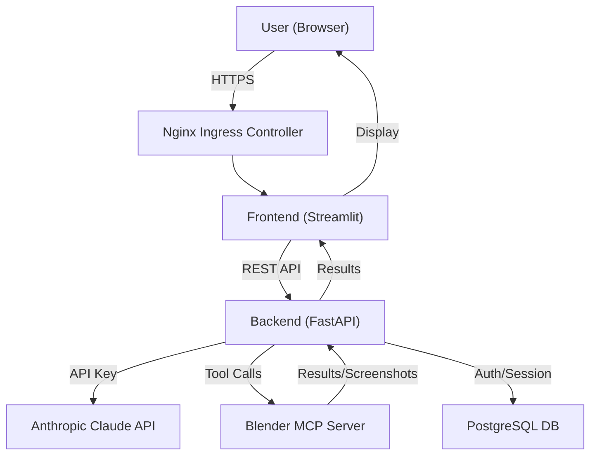

# Prompt2Mesh Architecture Overview

This document explains the detailed architecture and data flow of the Prompt2Mesh product.

---

## 1. High-Level Flow

1. **User accesses the Frontend (Streamlit Web UI) via browser**
2. **User logs in (auth via PostgreSQL)**
3. **User enters a prompt (e.g., “create a tree in Blender”)**
4. **Frontend sends request to Backend (FastAPI server)**
5. **Backend orchestrates AI and 3D operations:**
   - Calls Anthropic Claude API for prompt refinement and tool reasoning
   - Calls Blender MCP server for 3D object creation
   - Stores/retrieves data from PostgreSQL

---

## 2. Main Components

- **Frontend (Streamlit):** User interface, authentication, prompt input, result display
- **Backend (FastAPI):** Business logic, API orchestration, async job management, Anthropic API calls, Blender MCP tool calls, PostgreSQL integration
- **Blender MCP Server:** Per-user pods, executes Python code in Blender, returns results/screenshots
- **PostgreSQL Database:** User accounts, session info, (optional) user API keys
- **Anthropic Claude API:** Cloud LLM for prompt refinement/tool reasoning
- **Nginx Ingress Controller:** Manages external access, HTTPS via Let’s Encrypt

---

## 3. Data Flow Diagram

---

## 4. Key Features

- **Async Job System:** Backend handles long-running Claude/Blender jobs in background threads, with status polling.
- **Health Probes:** Kubernetes probes allow for long operations (up to 80 minutes liveness).
- **Timeouts:** All endpoints support up to 1-hour timeouts for large prompt processing.
- **Rate Limiting:** Exponential backoff for Claude API rate limits.
- **Screenshot Automation:** After object creation, Blender MCP auto-captures and returns screenshots.
- **Ingress Management:** External access managed by Nginx Ingress, with dynamic IP updates.

---

## 5. Deployment

- All components run as separate pods in AWS EKS.
- Docker images are built and pushed to AWS ECR.
- Deployments are managed via `kubectl` and YAML manifests.
- Ingress controller provides secure, public endpoints.

---

## 6. Billing

- By default, all Anthropic API usage is billed to the system API key.
- Optionally, per-user API keys can be implemented for user-specific billing.

---

## 7. References
- [CLOUD_DEPLOYMENT_GUIDE.md](C:/Prompt2Mesh/docs/CLOUD_DEPLOYMENT_GUIDE.md)
- [QUICKSTART.md](C:/Prompt2Mesh/docs/QUICKSTART.md)
- [K8S_DEPLOYMENT.md](C:/Prompt2Mesh/docs/K8S_DEPLOYMENT.md)
- [CONFIGURATION.md](C:/Prompt2Mesh/docs/CONFIGURATION.md)
